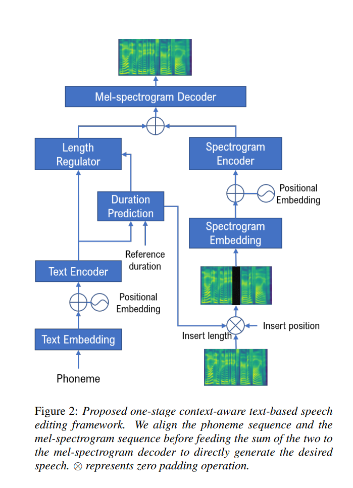

# Zero-Shot Text-to-Speech for Text-Based Insertion in Audio Narration
This repo contains only model Implementation of [Zero-Shot Text-to-Speech for Text-Based Insertion in Audio Narration paper](https://arxiv.org/abs/2109.05426).



## Citation
```
@misc{tang2021zeroshot,
      title={Zero-Shot Text-to-Speech for Text-Based Insertion in Audio Narration}, 
      author={Chuanxin Tang and Chong Luo and Zhiyuan Zhao and Dacheng Yin and Yucheng Zhao and Wenjun Zeng},
      year={2021},
      eprint={2109.05426},
      archivePrefix={arXiv},
      primaryClass={cs.SD}
}
```
## Note
* This repo only contains model implementation, not dataloader and training code, also it is not well tested from my side.
* For more complete TTS or Speech Synthesis solution please visit [DeepSync](https://deepsync.co/) .


